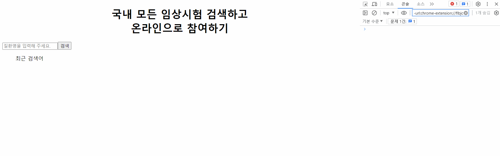

# 원티드 프리온보딩 인턴십 11차 4주차 과제

# 시작하기 앞서

<p align="center">
  
</p>

## 사용 방법

### 클라이언트 실행 방법

```
> git clone https://github.com/BrightSton/pre-onboarding-11th-task3.git
> npm install
> npm start
```

### 백엔드(서버)

https://github.com/walking-sunset/assignment-api

## 1. api 호출하기 (+ Data호출 메서드)

```js
import axios from "axios";

export const searchAPI = axios.create({
  baseURL: "http://localhost:4000",
  headers: {
    "Content-Type": "application/json",
  },
});

export const getSearchData = async (input = "") => {
  const response = await searchAPI.get(`/sick?q=${input}`);

  return response.data;
};
```

## 2 useDebounce hook

- 입력마다 API 호출하지 않도록 API 호출 횟수를 줄이는 전략 수립 및 실행
  - README에 전략에 대한 설명 기술

<br/>

- 위의 과제에 대한 해결 방법

```js
import { useEffect, useState } from "react";

const useDebounce = (value, setWaiting, limit = 500) => {
  const [debounceValue, setDebounceValue] = useState("");

  useEffect(() => {
    setWaiting(true);

    const timer = setTimeout(() => {
      setDebounceValue(value);
      setWaiting(false);
    }, limit);

    return () => {
      clearTimeout(timer);
    };
  }, [value, limit, setWaiting]);

  return debounceValue;
};

export default useDebounce;
```

## 3 API 호출별 로컬 캐싱 구현

- utils파일의 isCacheExpired파일과 trimCache파일을 통해 시간과 자료 사이즈에 따른 캐싱 구현.

<br/>

- 또한 useFetchSuggestions파일로 유틸 파일들을 불러와서 캐싱된 데이터 관리.

```js
// isCacheExpired.js
const CACHE_EXPIRATION_TIME = 15 * 60 * 1000;

export const isCacheExpired = (cacheData) => {
  return Date.now() - cacheData.timestamp > CACHE_EXPIRATION_TIME;
};
```

```js
// trimCache.js
const MAX_CACHE_SIZE = 100;

export const trimCache = (cacheData) => {
  const cacheKeys = Object.keys(cacheData);
  if (cacheKeys.length > MAX_CACHE_SIZE) {
    const oldestKey = cacheKeys.reduce((prevKey, currentKey) =>
      cacheData[prevKey].timestamp < cacheData[currentKey].timestamp
        ? prevKey
        : currentKey
    );
    const { [oldestKey]: removedItem, ...trimmedCache } = cacheData;
    return trimmedCache;
  }
  return cacheData;
};
```

```js
// useFetchSuggestions.js
import { useCallback, useState } from "react";
import { isCacheExpired } from "../../utils/isCacheExpired";
import { getSearchData } from "../apis";
import { trimCache } from "../../utils/trimCache";

const useFetchSuggestions = () => {
  const [cache, setCache] = useState({});

  const fetchSuggestions = useCallback(
    async (input) => {
      if (cache[input] && !isCacheExpired(cache[input])) {
        return cache[input].data;
      } else {
        const response = await getSearchData(input);
        const timestamp = Date.now();
        const newCache = {
          ...cache,
          [input]: { data: response, timestamp },
        };
        // 캐시 크기가 최대 크기를 초과하는 경우 캐시를 조정합니다.
        setCache(trimCache(newCache));
        return response;
      }
    },
    [cache, setCache]
  );

  return fetchSuggestions;
};

export default useFetchSuggestions;
```
